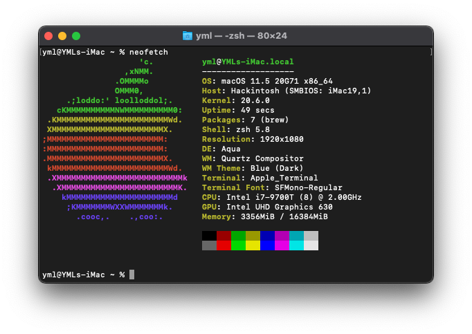

# OpenCore on Dell OptiPlex 7070 MFF

OpenCore for macOS Big Sur (11.5) on Dell OptiPlex 7070 MFF

## Tutorials

-   [W-MS/Dell-8080-mff-hackintosh](https://github.com/W-MS/Dell-7070-mff-hackintosh)
-   [cyrusauyeungc/Dell-Optiplex-7070m-Hackintosh-EFI](https://github.com/cyrusauyeungc/Dell-Optiplex-7070m-Hackintosh-EFI)

## Hardware

-   CPU: Intel Comet Lake i7-9700T
-   Chipset: Intel Q370
-   Memory: 8G DDR4 2666 \* 2
-   iGPU: UHD 630
-   SSD: Intel SATA SSD 120G
-   Sound: ALC255/ALC3234
-   Ethernet: Intel I219-LM
-   Wireless / BT: Intel Wireless-AC 9560

## Status

### :white_check_mark: Working

-   HWP
-   Sleep
-   iGPU with HiDPI
-   Ethernet
-   WiFi
-   Bluetooth
-   Sound
-   DP/HDMI Audio

### :x: Not Working

-   DRM (Only dGPU could fix this)

## BIOS Settings
* General → Advanced Boot Options: ***uncheck***
* System Configuration → SATA Operation: ***AHCI***
* Secure Boot → Secure Boot Enable: ***Disabled***
* Intel® Software Guard Extensions™ → Intel® SGX™ Enable: ***Disabled***
* Power Management → Block Sleep: ***check***
* Virtualization Support → VT for Direct I/O: ***uncheck***
* Security → PTT Security/PTT On: ***Disabled***

## BIOS Settings via modGRUBShell.efi
* Set Pre-Allocated DVMT to 64M: 
***setup_var 0x8DC 0x02***
* Disable CFG lock: 
***setup_var 0x5BE 0x00***

## Point to Note

*   [x] Please add your own SystemSerialNumber / SystemUUID / MLB with [GenSMBIOS](https://github.com/corpnewt/GenSMBIOS)

## Updates

-   **2021/7/23**: First install with OpenCore 0.7.0
